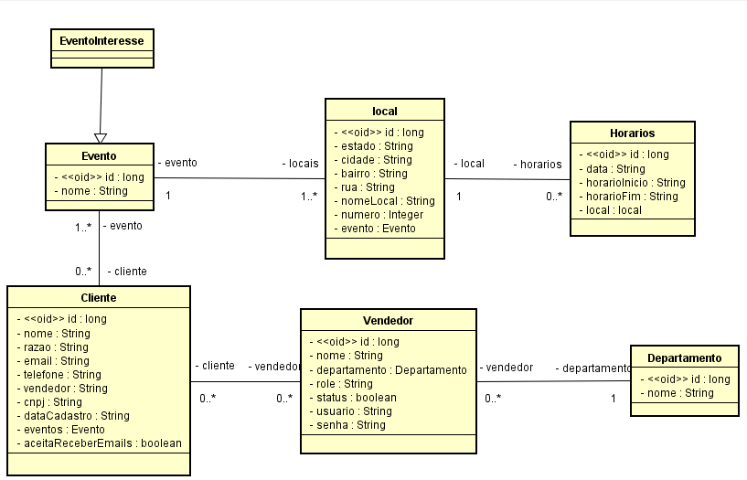
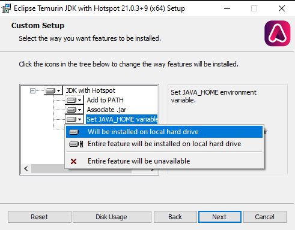
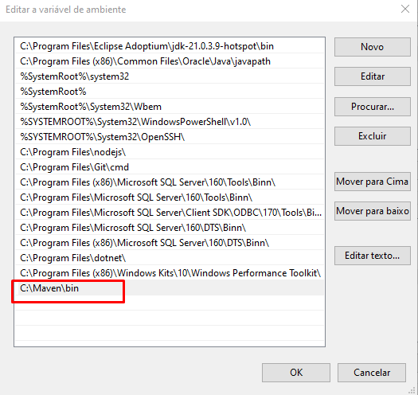

# Projeto MyEvent
Um projeto de gerenciamento de clientes e vendedores, utilizando um sistema de login utilizando Java 17, Spring 3.x, Spring security, JPA, tokens JWT e mais.

**Este projeto foi feito apenas para fins academicos sem fins lucrativos. todas as imagens que estão disponiveis neste projeto foram realizadas com inteligência artificial ou autoria propria do autor.**

O projeto foi realizado para tentar atender a demanda de uma empresa ficticia que realiza eventos com frequencia. e que necessitava gerenciar todos os clientes que desejam e participam de um ou mais evento. Assim conseguindo gerenciar as suas equipes de vendas de quantos clientes se interessaram pelo evento de tecnologia, e quantos que compareceram.


Em questão de dados. o projeto foi totalmente pensado na segurança no qual alguem com o setor 'Vendedor' apenas conseguiria acessar os dados do cliente apenas se o cliente tiver vinculo com ele. mas também consegue criar um novo cliente pelo sistema caso seja necessario, caso contrario o vendedor não conseguirá visualizar os outros cadastros de outros vendedores. Já o departamento Admin ou TI são responsaveis pelo sistema ao todo, tendo todo o acesso para criar / editar todos os campos como criação ou edição de eventos além da criação e bloqueio de acesso. Também é possivel realizar todas as consultas de todos os vendedores puxando todos os dados.


No site principal, existe um formulario para cadastro do cliente. nesta etapa existe 2 possibilidades durante o cadastro.
- O cliente se cadastrar pela primeira vez (Não existe cadastro) então o sistema criará para ele um novo cadastro e também vinculando ele ao interesse para participar do evento. A tabela de interesse seria uma previa de quantas pessoas iriam ao evento, mas não significa que essa pessoa realmente irá.

- O Cliente já tem cadastro. Para previnir valores duplicados no banco de dados de cliente. existe uma função que busca o cliente pelo cnpj. se ele encontrar, apenas vinculará ele para o interesse no evento

Também existe a função do vendedor, no qual poderá retornar apenas duas possibilidades. O cliente vai colocar o nome do vendedor no qual o banco de dados vai verificar o valor.

- Se o vendedor existir com o nome, vinculará automaticamente o vendedor com o cliente

- Se não existir ou o cliente digitou alguma letra ou valor errado, o cliente vai ser vinculado a um usuario que foi feito pelo sistema como "Sem vinculo". sendo possivel altera-lo para o vendedor adequado. Ou também um novo vendedor no qual a administração vai conseguir gerenciar.


O projeto foi desenvolvidor por **Matheus Marano**.

## Diagrama UML


## Bibliotecas utilizadas

Se você ja tiver esses itens instalados, apenas ignorar.


Foi utilizadas as Bibliotecas do Angular como: 

**Node JS**


Para instalar o NodeJS entre no site e realiza a instalação do node que é necessário para rodar o projeto:


[Ultima atualização desse link, 18/07/2024]


https://nodejs.org/pt


**Angular CLI** 


Para instalar o Angular CLI basta executar o comando abaixo, lembrando que você deve ter previamente instalado o NodeJS conforme foi informado acima.

```
npm install -g @angular/cli@17
```


**Front-end Angular material**
```
ng add @angular/material
```
Neste comando, vai pedir para você escolher o tema. o projeto foi realizado no tema azure blue, conforme mostrado no angular.json (@angular/material/prebuilt-themes/azure-blue.css)


**Front-end ngx-slick-carousel**


Esta biblioteca utilizamos para fazer o carousel da home-page, e as imagens inseridas através do CSS para obter responsibilidade nas imagens.


Leia mais sobre: https://www.npmjs.com/package/ngx-slick-carousel#ngx-slick-carousel
```
npm install jquery --save
npm install slick-carousel --save
npm install ngx-slick-carousel --save
```

**Back-end: Java**


Instalação do Java JDK. recomendavel utilizar a partir da versão 17+ de preferência uma versão LTS para garantia de suporte dos colaboradores do software.


Foi utilizado no projeto a versão do JDK através da empresa Eclipse Foundation (adoptium). instale a versão LTS e pode ser utlizada a versão mais recente que o projeto não vai ter dificuldade em executar em versões mais atualizadas.
https://adoptium.net/

Uma coisa importante é que durante a instação do JDK, é que você deve ter também em suas variaveis de ambiente a variavel **JAVA_HOME**. Se caso você não tiver, durante a instalação do JDK vai perguntar se você quer colocar também essa variavel de ambiente de forma automatica. coloque que sim que você vai conseguir executar o comando do java no cmd que vou explicar ainda nesse readme a execução.



**Back-end: Java Maven**


Instalar o maven em:
https://maven.apache.org/download.cgi

Adicionar as variaveis de ambiente do Maven para executar o back-end. Para executar basta pesquisar no windows "Variaveis de ambiente"
selecionar a variavel Path e clicar em editar, lá tem a opção de adicionar. então você seleciona até a pasta bin do Maven para que ele seja executado.




## Executando o software.

### Banco de dados:
Este projeto utilizou o Banco de dados PostgreSQL, mas pode ser utilizado qualquer outro banco de dados como (Oracle, MariaDB, SQLServer, H2-Console dentre outros.)


Foi configurado na porta padrão do Postgres (5432) com o nome da database de **evento** que deverá ser criada previamente antes de ser executada. ao ser executada o Spring verificará se vai ser necessário criar as tabelas bem como a instanciação dos objetos de teste do banco de dados. se não tiver nada o spring colocara os dados que ja foram selecionados anteriormente pelo criador do projeto.


### Inicialização back-end
Se você ja tiver tudo instalado igual demonstrado acima, vamos inicializar o nosso back-end primeiro. para isso execute o arquivo **'MyEvent-executavel.bat'** que se encontra em **evento/target/** que vai abrir o CMD com o java e logo executar o sistema spring.


Gostou desse readme ou projeto? deixe uma estrela para saber se você gostou. Se ficou faltando explicar alguma coisa, me avise que estarei ajustando. Obrigado a todos.

### Inicialização front-end

entre na pasta do evento-app, e inicie um terminal (pode ser git bash ou cmd windows, além do terminal linux se você estiver em um sistema operacional linux.)


realize o comando abaixo para baixar todas as library (bibliotecas) que foram utilizados durante a instalação do software. 
```
npm install
```
Depois que esse comando foi realizado. execute o comando abaixo para executar o front-end:
```
ng serve

ou

ng serve --open
```

o ng serve --open serve para inicializar a aplicação e ja abri-lá, sem precisar colocar no navegador a url: http://localhost:4200


### Usuario de login do sistema
O sistema quando inicializado pela primeira vez, ele cria automaticamente o usuario administrador:


**usuario:** admin


**password:** 123456


Criado por: **Matheus Marano**